# README项目文档

具体代码实现以main分支为准，如需运行代码，可采用linux分支下的实现。
演示视频：https://www.bilibili.com/video/BV1AQ4y177Ra/

## 项目简介

南京大学软件学院软件测试课程大作业，选题方向为：**程序分析-变异测试**。

实现了一个变异测试工具，操作流程如下：

1. 变异选择，在abs、aor、lcr、ror、uoi等突变算子中选择一个，对于对应的程序进行突变，生成的突变体存放在`/pool` 目录下；
2. 变异生成，将`/pool` 目录下的突变体程序编译；
3. 变异执行，对于`/pool` 目录下的突变体，执行对应的测试套件，并计算突变得分。

具体操作流程可看下文详细叙述。

**本项目特点**如下：

1. 实现了新的突变算子AIR
2. 优雅的代码实现，包括使用**策略模式和访问者模式**的设计模式，代码具有高可拓展性和高可读性。

**本项目主架构**如下：

CLI：

```
├── bin
│   └── mut-cli.js #mut-cli命令定义和描述、参数定义
├── lib
│   ├── build.js     # build命令脚本
│   ├── diff.js      # diff命令脚本
│   ├── num.js       # num命令脚本
│   ├── select.sh    # build select阶段
│   ├── compile.sh   # build compiler阶段
│   ├── score.sh     # build score阶段
│   ├── num.sh       
│   └── diff.sh
├── node_modules #依赖的库
```

后端：

```
├── src
│   ├── main
│   │   ├── java
│   │   │   ├── edu
│   │   │   │   └── nju
│   │   │   │       └── mutest
│   │   │   │           ├── MutationEngine.java # 突变选择
│   │   │   │           ├── MutationExecution.java # 突变得分计算
│   │   │   │           ├── example # 测试样例
│   │   │   │           │   ├── ABSExample.java # abs突变算子对应的测试样例
│   │   │   │           │   ├─ # ...
│   │   │   │           ├── mutator # 突变算子的实现
│   │   │   │           │   ├── ABSMutator.java
│   │   │   │           │   ├── AbstractMutator.java
│   │   │   │           │   ├── AIRMutator.java
│   │   │   │           │   ├── AORMutator.java
│   │   │   │           │   ├── BinaryMutator.java
│   │   │   │           │   ├── LCRMutator.java
│   │   │   │           │   ├── Mutator.java
│   │   │   │           │   ├── RORMutator.java
│   │   │   │           │   └── UOIMutator.java
│   │   │   │           └── visitor # 突变点收集、收集条件判断等
└── testsuite # 测试套件
    └── edu
        └── nju
            └── mutest
                └── example
                    ├── ABSTestSuite.class # 突变测试
                    ├── # ...
```

## 研究背景

在软件工程领域，为了确保软件系统的质量和可靠性，测试是一个至关重要的环节。测试套件是通过设计的一组测试用例，用于验证软件系统在各种情况下的正确性和稳定性。然而，仅仅依赖传统的测试方法可能无法充分地覆盖各种可能的情况，因此研究人员一直在寻求创新的测试方法来提高测试的效率和覆盖面。

变异测试作为一种重要的测试技术，旨在评估测试套件的质量，通过引入人为引入的变异来模拟程序中的错误。变异测试的基本思想是通过对原始代码引入有限的变异（修改、删除或插入语句），生成变异体，然后运行测试套件来检测这些变异体是否被检测出来。如果测试套件能够检测出变异体，说明该变异体与原始代码之间存在差异，从而增加了测试的覆盖面和可靠性。

在这一背景下，本项目旨在探讨并实现基于变异测试的测试方法。通过本项目的研究，我们希望在现有的变异测试方法基础上做进一步的创新和优化。通过引入更具针对性和智能化的变异算子，提升测试套件的敏感性，使其更容易检测出代码中的潜在缺陷。通过在变异测试框架中的创新，我们期望为软件测试领域带来更具实用性和前瞻性的解决方案，为开发人员提供更强大的工具和技术，以提高软件系统的可靠性和稳定性。

## 项目配置与运行

运行环境：Ubuntu20.04（目前只在linux环境下进行过测试）

需要将项目目录下的/cli单独剪切放置在/home文件夹下，将本项目放置在/home下。home目录下的结构如下：

```
├──cli
├──Fuzzaroo
```

需要在java11的环境下进行运行，若没有请自行配置，若环境中存在多个java版本，可用一下命令进行切换：

```bash
update-alternatives --config java
update-alternatives --config javac
```

具体也可参照工具类的演示视频

## 项目架构

### CLI

通过nodejs编写自定义CLI库，引入commander库和shelljs库。

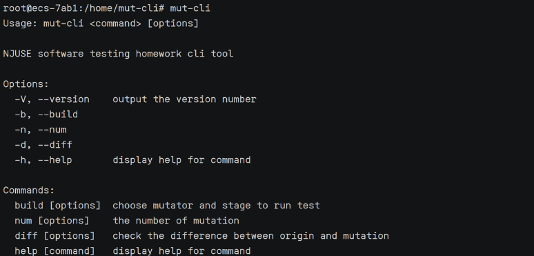

编写了5个命令：

`-V, --version` 用于查看版本号；

`-b, --build` 用于执行突变；

`-n, --num` 用于查看生成的突变体数目；

`-d, --diff` 用于查看具体某一个突变体的突变点；

`-h. --help` 用于输出帮助信息。

#### version

`version` 命令：

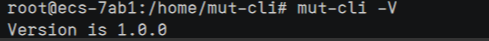

#### build

`build` 命令：

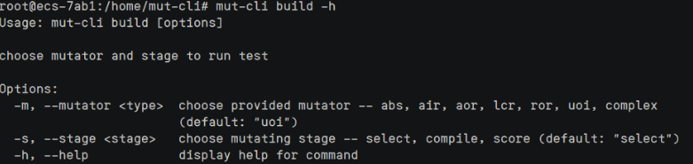

build命令可以选择突变算子和突变阶段。

`-m` 参数选择突变算子，可选择的突变算子有abs, air, aor, lcr, ror, uoi, complex。其中，abs, air, aor, lcr, ror, uoi均为单独的突变算子，complex综合了其他所有突变算子。

`-s`参数选择突变阶段，可选择的突变阶段有select, compile, score，即分别对应变异选择、变异生成和变异执行的阶段。

`-t` 参数选择测试套件。

执行build命令之后，会将生成的结果生成log保存到项目根目录下以便查看。

#### num

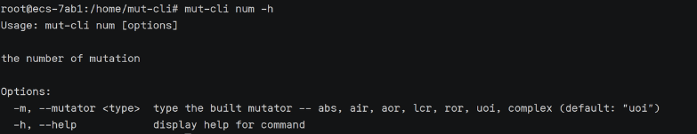

num命令用于build命令完成之后，可查看生成的突变体数量。

`-m` 参数输入刚刚选择的突变算子。

#### diff

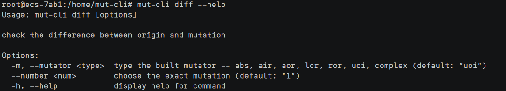

diff命令用于build命令完成之后，可查看具体某个突变体的突变点。

`-m` 参数输入刚刚选择的突变算子。

`--number` 参数选择想查看的突变体序号。

#### help

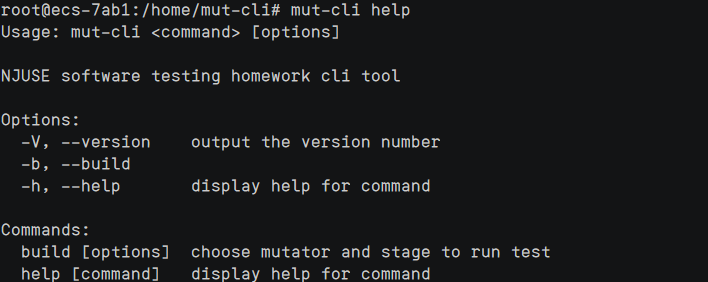

#### 操作流程

首先，运行build命令，选择某个突变算子，分别执行三个阶段（select、compile、score）。具体的输出可在log中查看。

然后，运行num命令，查看突变数。

最后，运行diff命令，查看突变点。

mut-cli的命令运行展示：

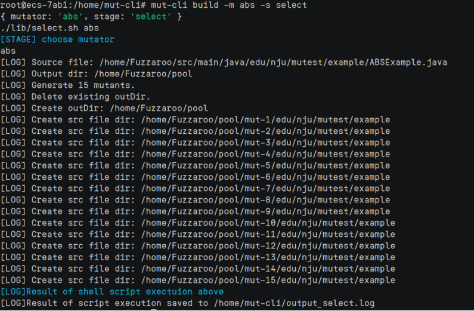

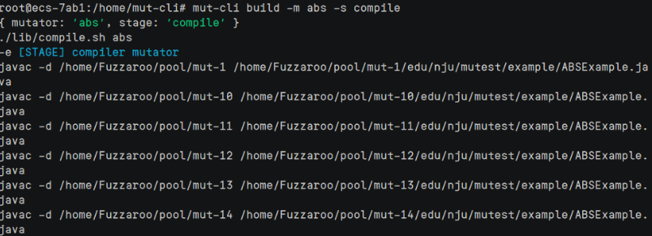

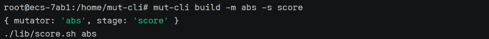

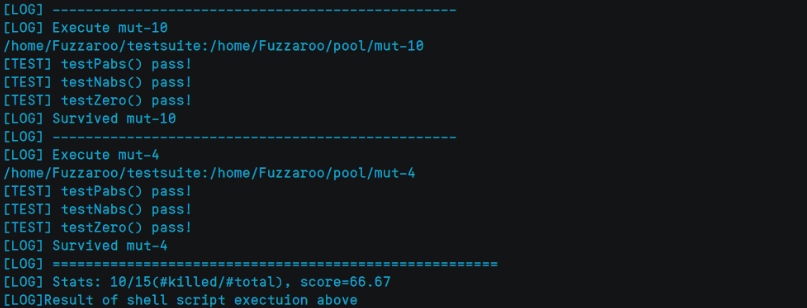

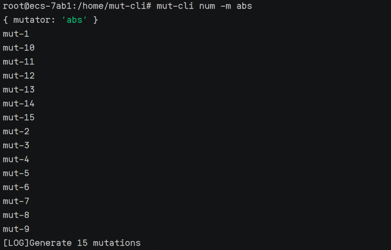

共生成了15个突变体，选择1号突变体，查看不同的地方。

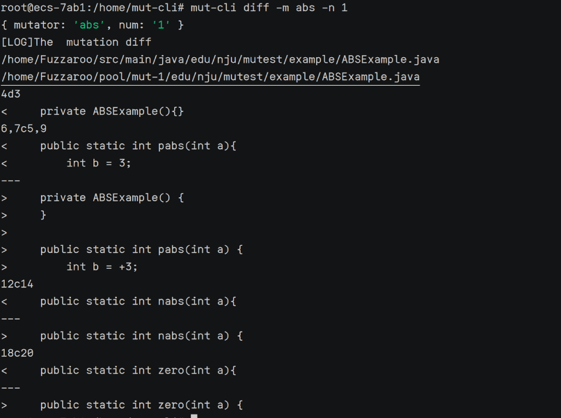

### 后端

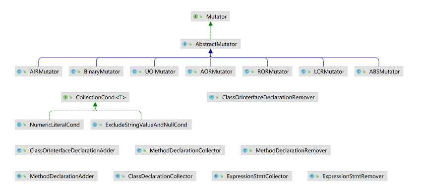

#### 变异选择

在本项目中，我们首先选择了五种基本的突变算子，这些算子分别是ABS（绝对值变异算子）、AOR（算术操作符替换变异算子）、LCR（逻辑连接词替换变异算子）、ROR（关系操作符替换变异算子）以及UOI（无效操作符插入变异算子）。之后，我们还加入了新的变异算子AIR，这将在之后的“加分点”部分中详细介绍。

1. **ABS（绝对值变异算子）**：该算子主要通过将数值型变量的绝对值引入代码中，模拟了一种对数值的绝对值操作。这有助于测试套件捕捉在对数值的处理过程中可能出现的错误和边界情况。

2. **AOR（算术操作符替换变异算子）**：AOR算子通过替换算术运算符（如加法、减法、乘法等）来生成变异体，以评估测试套件对于算术操作的覆盖程度。这有助于检测在数学计算方面的潜在问题。

3.  **LCR（逻辑连接词替换变异算子）**：逻辑连接词替换算子主要通过替换逻辑运算中的连接词（如AND、OR）来生成变异体，以评估测试套件对于程序中逻辑判断的覆盖情况。这有助于检测在条件判断中可能存在的逻辑错误。

4. **ROR（关系操作符替换变异算子）**：ROR算子通过替换关系运算符（如等于、大于、小于等）来生成变异体，以评估测试套件对于关系判断的覆盖程度。这有助于发现在条件判断中可能存在的关系错误。

5. **UOI（无效操作符插入变异算子）**：无效操作符插入算子主要通过向代码中插入无效的操作符来生成变异体，以评估测试套件对于错误输入或无效操作的处理能力。这有助于检测在异常情况下程序的稳定性和鲁棒性。

这些变异算子的选择基于对不同类型错误的考虑，通过引入这些变异体，我们旨在评估测试套件的全面性和有效性，以提高软件系统的测试覆盖率和质量。


#### 变异生成

##### ABS - Absolute Value Insertion

每一个算数表达式，被处理为绝对值、负的绝对值和零

`locateMutationPoints` 方法：

调用collect方法在origCU中找到所有的method，然后在每一个method中找到所有的ExpressionStmt，其中的Expression就是潜在的突变点，并用collectPoints方法筛选出LiteralExpr类型、UnaryExpr类型和BinaryExpr类型。

```java
@Override
public void locateMutationPoints() {
    List<MethodDeclaration> methods = MethodDeclarationCollector.collect(this.origCU);
    for(MethodDeclaration method: methods){
        List<ExpressionStmt> exprStmts = new ArrayList<>();
        ExpressionStmtCollector.collect(method, exprStmts);
        for(ExpressionStmt exprStmt: exprStmts){
            Expression expr = exprStmt.getExpression();
            collectPoints(expr);
        }
    }
}
```

`mutate` 方法：

首先，进行绝对值和负的绝对值突变，方法为添加正负号以达到计算绝对值的效果。对于选出的突变点进行筛选，仅对LiteralExpr(int/double)类型、UnaryExpr(-c, -2)类型、BinaryExpr(a +b)类型进行突变。

然后，进行零突变，方法为将表达式直接替换为零，对于所有表达式都生效。

```java
for(Expression expr: mutPoints){
    if(expr instanceof LiteralExpr){
        // 适用于int或者double的转换
        for(UnaryExpr.Operator targetOp: unaryTargetOps){
            UnaryExpr targetExpr = new UnaryExpr(expr, targetOp);
            EnclosedExpr enclosedExpr = new EnclosedExpr(targetExpr);
            UnaryExpr newTargetExpr = new UnaryExpr(enclosedExpr, UnaryExpr.Operator.PLUS);
            mutants.add(insertUnaryExpr(newTargetExpr, expr));
        }

    }else if(expr instanceof UnaryExpr){
        // 适用于 c = -2, 或者 a = -c + 2这类表达式
        UnaryExpr.Operator origOp = ((UnaryExpr) expr).getOperator();
        for(UnaryExpr.Operator targetOp : unaryTargetOps){
            if (origOp.equals(targetOp)) continue;
            UnaryExpr targetExpr = new UnaryExpr(((UnaryExpr) expr).getExpression(), targetOp);
            mutants.add(insertUnaryExpr(targetExpr, expr));
        }
    }else if (expr instanceof BinaryExpr){
        // 适用于 a + b 的整体转换
        for(UnaryExpr.Operator targetOp: unaryTargetOps){
            EnclosedExpr enclosedExpr = new EnclosedExpr(expr);
            UnaryExpr targetExpr= new UnaryExpr(enclosedExpr, targetOp);
            mutants.add(insertUnaryExpr(targetExpr, expr));
        }
    }
    IntegerLiteralExpr zeroExpr = new IntegerLiteralExpr(0);
    mutants.add(insertUnaryExpr(new UnaryExpr(zeroExpr, UnaryExpr.Operator.PLUS), expr)); // 虽然都变成+0了，但感觉也是正确的
}
```

`ReplaceExpressionVisitor`内部类:

继承`VoidVisitorAdapter<Void>`完成表达式替换的工作，分别处理了表达式类型为ExpressionStmt, UnaryExpr, IntegerLiteralExpr, DoubleLiteralExpr, BinaryExpr的情况。以IntegerLiteralExpr为例：

```java
@Override
public void visit(IntegerLiteralExpr n, Void arg){
    super.visit(n, arg);
    if(n.equals(originalExpr)){
        n.replace(newExpr);
    }
}
```

##### AOR - Arithmetic Operator Replacement

加减乘除模符号相互替换，包括 +-*/%。

首先定义AOR突变算子中的操作符。

```Java
private BinaryExpr.Operator[] targetOps = {
        PLUS, MINUS, MULTIPLY, DIVIDE, REMAINDER
};
```

在突变的时候，排除其他的BinaryExpr.Operator以防止出现错误变异的情况。

```Java
for (BinaryExpr.Operator targetOp: targetOps){
    if(origOp.equals(targetOp)){
        flag = true;
        break;
    }
}
```

并排除了BinaryExpr参数为String和Char类型的情况。

```Java
if(left instanceof StringLiteralExpr || left instanceof CharLiteralExpr || left instanceof FieldAccessExpr) continue;
if(right instanceof StringLiteralExpr || right instanceof CharLiteralExpr|| right instanceof FieldAccessExpr) continue;
```

最终，在每一个突变点，进行操作符的替换。

```Java
for (BinaryExpr.Operator targetOp : targetOps) {
    // Skip self
    if (origOp.equals(targetOp))
        continue;
    // Mutate
    mutants.add(mutateOnce(mp, targetOp));
}
```

##### LCR - Logical Connector Replacement 

逻辑运算符相互替换，如& | ^ && ||

自动识别代码中的逻辑运算符如&，|，^，&&，||，并分别对两种情况——按位运算符&、｜、^和逻辑运算符&&、||进行区分。

```Java
private BinaryExpr.Operator[] targetOps1 = {
            BinaryExpr.Operator.BINARY_AND,
            BinaryExpr.Operator.BINARY_OR,
            BinaryExpr.Operator.XOR,
    };
private BinaryExpr.Operator[] targetOps2 = {
            AND,
            OR
    };
```

判断表达式中是否含有运算符：

```Java
private boolean containsTargetOperator1(BinaryExpr.Operator op) {
        for (BinaryExpr.Operator targetOp : targetOps1) {
            if (op.equals(targetOp)) {
                return true;
            }
        }
        return false;
    }
    private boolean containsTargetOperator2(BinaryExpr.Operator op) {
        for (BinaryExpr.Operator targetOp : targetOps2) {
            if (op.equals(targetOp)) {
                return true;
            }
        }
        return false;
    }
```

对于逻辑运算符&&和||，由于它们只能处理布尔表达式，因此对它们不与按位运算符替换。对于按位运算符&、｜和^，虽然它们也能处理布尔值，但&与&&、|与||效果相同，最终替换后结果将为等效变异体，因此也不与逻辑运算符&&和||替换。故变异实现如下：

```Java
    public List<CompilationUnit> mutate(){
        // Sanity check.
        if (this.mutPoints == null)
            throw new RuntimeException("You must locate mutation points first!");

        // Modify each mutation points.
        for (BinaryExpr mp : mutPoints) {
            // This is a polluted operation. So we preserve the original
            // operator for recovering.
            BinaryExpr.Operator origOp = mp.getOperator();

            // Generate simple mutation. Each mutant contains only one
            // mutated point.
            for (BinaryExpr.Operator targetOp : targetOps1) {
                // Skip self
                if (origOp.equals(targetOp) || !containsTargetOperator1(origOp))
                    continue;
                // Mutate
                mutants.add(mutateOnce(mp, targetOp));
            }
            for (BinaryExpr.Operator targetOp : targetOps2) {
                // Skip self
                if (origOp.equals(targetOp) || !containsTargetOperator2(origOp))
                    continue;
                // Mutate
                mutants.add(mutateOnce(mp, targetOp));
            }

            // Recovering
            mp.setOperator(origOp);

        }

        return this.mutants;
    }
```

该方法通过containsTargetOperator1和containsTargetOperator2检查给定操作符是否包含在目标操作符数组中，对&、 |、 ^ 相互替换，&&、 ||相互替换，从而进行变异。

##### ROR-Relational Operator Replacement

ROR(Relational Operator Replacement)，包括运算符 (< <= = = !=)。

```SQL
private BinaryExpr.Operator[] targetOps2 = {
        LESS, LESS_EQUALS, GREATER, GREATER_EQUALS, EQUALS, NOT_EQUALS
};
```

在这一部分，我们首先用程序RORMutator生成变异体到pool池中。该程序思路是：

当遇到属于集合{< <= = = !=}的运算符时，即将其替换成其他关系运算符或者falseOp或trueOp。每个程序只有一处改动，即我们生成了|程序中RO数量|*(|RO类型数|-1+2)个变异体。

我们排除了其他类运算符的影响：

```SQL
private boolean containsTargetOperator2(BinaryExpr.Operator op) {
    for (BinaryExpr.Operator targetOp : targetOps2) {
        if (op.equals(targetOp)) {
            return true;
        }
    }
    return false;
}
```

并生成了变异：

```SQL
for (BinaryExpr.Operator targetOp : targetOps2) {
    // skip self
    if (origOp.equals(targetOp) || !containsTargetOperator2(origOp))
        continue;
    // Mutate
    mutants.add(mutateOnce(mp, targetOp));
}
```

接着，我们编写testsuite用来测试。我们首先编写了单一的RORTestSuite用于初步的简单测试：

```SQL
public static void main(String[] args) {
    testLes();
    testGre();
    testLesE();
    testGreE();
    testEqu();
    testNotE();
}
private static void testLes() {
    boolean oracle = false;
    boolean res = RORExample.less(2, 2);
    if (oracle == res)
        System.out.println("[TEST] testLes() pass!");
    else
        throw new RuntimeException(String.format(
                "[TEST] testLes() fail (%b, %b)!", oracle, res));
}
//对其他运算符的测试类似，此处略去
```

得到了24/42=57.14%的杀伤率，成功验证了我们测试套件和变异算子（变异体）的有效性和良好的结合效果。

此外，我们还编写了复杂的测试套件ComplexTestSuite，用来确认包括ROR在内的全体变异算子在应对复杂情况时的有效性。

##### UOI - Unary Operator Insertion

自动识别代码中的一元操作符，如！、~、++、--等进行替换，以及实现了如变异后自动加括号提升表达式优先级等防止语法报错的功能。如`return a == b;` -> `return !(a == b);`

`mutate` 方法:

主要的变异逻辑。如果 `mutPoints` 为空，则抛出异常。对每个变异点应用所有适用的一元操作符，并生成变异后的 `CompilationUnit` 对象。

```Java
@Override
public List<CompilationUnit> mutate() {
    if (mutPoints.isEmpty())
        throw new RuntimeException("没有找到适合变异的点！");

    for (Expression expr : mutPoints) {
        for (UnaryExpr.Operator op : uoiOperators) {
            if (isOperatorApplicable(expr, op)) {
                UnaryExpr unaryExpr = new UnaryExpr(expr.clone(), op);
                // 特殊处理逻辑非操作符
                if (op == UnaryExpr.Operator.LOGICAL_COMPLEMENT && needsParentheses(expr)) {
                    unaryExpr = new UnaryExpr(new EnclosedExpr(expr.clone()), op);
                }
                mutants.add(insertUnaryExpr(unaryExpr, expr));
            }
        }
    }
    return mutants;
}
```

`isBooleanExpression `方法:

检查给定的表达式是否为布尔表达式。这对于逻辑补码运算符是必要的，因为它只适用于布尔表达式。

```Java
private boolean isBooleanExpression(Expression expr) {
    if (expr instanceof BinaryExpr) {
        BinaryExpr binaryExpr = (BinaryExpr) expr;
        switch (binaryExpr.getOperator()) {
            case EQUALS:
            case NOT_EQUALS:
            case LESS:
            case LESS_EQUALS:
            case GREATER:
            case GREATER_EQUALS:
            case OR:
            case AND:
                return true;
            default:
                return false;
        }
    } else if (expr instanceof UnaryExpr) {
        UnaryExpr unaryExpr = (UnaryExpr) expr;
        return unaryExpr.getOperator() == UnaryExpr.Operator.LOGICAL_COMPLEMENT;
    } else if (expr instanceof MethodCallExpr || expr instanceof BooleanLiteralExpr) {
        return true;
    }
    return false;
}
```

`isOperatorApplicable` 方法:

确定给定的一元操作符是否适用于特定表达式。例如，递增/递减操作符通常适用于变量表达式，逻辑补码适用于布尔表达式。

```Java
private boolean isOperatorApplicable(Expression expr, UnaryExpr.Operator op) {
    // 基于表达式的类型和结构来决定是否适用操作符
    switch (op) {
        case PREFIX_INCREMENT:
        case PREFIX_DECREMENT:
            // 增加和减少运算符通常适用于变量（例如，NameExpr）
            return expr instanceof NameExpr || expr instanceof FieldAccessExpr;

        case LOGICAL_COMPLEMENT:
            // 确保表达式是有效的布尔表达式
            return isBooleanExpression(expr);

        case PLUS:
        case MINUS:
        case BITWISE_COMPLEMENT:
            // 通常适用于数字类型
            // 可以根据表达式的类型进行更精确的检查
            return expr instanceof LiteralExpr || expr instanceof BinaryExpr ||
                    expr instanceof UnaryExpr || expr instanceof NameExpr ||
                    expr instanceof MethodCallExpr || expr instanceof FieldAccessExpr;

        default:
            return false;
    }
}
```

`needsParentheses` 方法:

判断是否需要在表达式周围添加括号。这在使用逻辑补码操作符时特别重要。

```Java
private boolean needsParentheses(Expression expr) {
    // 判断是否需要括号包围表达式
    return !(expr instanceof EnclosedExpr || expr instanceof BooleanLiteralExpr || expr instanceof NameExpr);
}
```

#### 变异执行

MutationEngine根据传入的源文件和变异算子（如abs、aor、lcr、ror、uoi等）在pool中生成变异体，然后执行`bash compile-mutants.sh pool/`生成变异体编译后的可执行文件。

```Bash
# Compile mutants
for FN in $(ls "$POOL_DIR")
do
  # Locate dir for each mutant
  MUT_DIR="$POOL_DIR/$FN"
  # Locate each source file.
  for SRC_FILE in $(find "$MUT_DIR" | grep ".java")
  do
    # Compile and output to the directory.
    echo "javac -d $MUT_DIR $SRC_FILE"
    javac -d "$MUT_DIR" "$SRC_FILE"
  done
done
```

同时，在测试套件执行后，进入`target`文件夹将其编译后的.class文件copy到`/testsuite`文件夹下，接着开始进入变异执行。

在`DemoMutantExecution`中，首先根据输入的参数确定测试套件目录和变异体池目录，根据输入的变异策略获得相应全限定名。

接着，对变异体进行定位，获取变异体池目录下的所有文件，过滤掉以.开头的文件，得到变异体目录的列表，并计算变异体的数量。

```Java
// Locate all mutants
File[] fns = mutPoolDir.listFiles();
if (fns == null) {
    System.out.println("[LOG] Find no mutants!" );
    System.exit(0);
}
List<File> mutDirs = Arrays.stream(fns)
        .filter(f -> !f.getName().startsWith("."))
        .collect(Collectors.toList());
int mutNum = mutDirs.size();
System.out.printf("[LOG] Locate %d mutants\n", mutNum);
```

然后遍历变异体目录列表，对每个变异体进行变异执行，判断是否存活。

```Java
for (File mutDir : mutDirs) {
    System.out.println("[LOG] -------------------------------------------------");
    String mutName = mutDir.getName();
    System.out.println("[LOG] Execute " + mutName);
    boolean killed = execute(tsDir, mutDir);
    if (killed) {
        killedCnt++;
        System.out.println("[LOG] Killed " + mutName);
    } else
        System.out.println("[LOG] Survived " + mutName);
}
```

具体的变异体执行逻辑在 `execute` 方法中实现。`execute` 方法使用 `ProcessBuilder` 构建一个 Java 进程执行变异体，调用 `p.exitValue()` 获取 Java 进程的退出值。如果退出值为 0，说明变异体存活（survived），返回 `false`；否则，说明变异体被杀死（killed），返回 `true`。

```Java
private static boolean execute(File tsDir, File mutDir) throws IOException, InterruptedException {
        // Build class path.
        String cp = concateClassPath(tsDir.getAbsolutePath(), mutDir.getAbsolutePath());
        System.out.println(cp);

        // Construct executor
        ProcessBuilder pb = new ProcessBuilder("java", "-cp", cp, TEST_SUITE_FQN);
        pb.redirectErrorStream(true);
        Process p = pb.start();
        BufferedReader br = new BufferedReader(new InputStreamReader(p.getInputStream()));
        // Wait for execution to finish, or we cannot get exit value.
        p.waitFor();

        // Read execution info
        String line;
        while (true) {
            line = br.readLine();
            if (line == null) break;
            System.out.println(line);
        }

        // 0 means survived, not 0 means killed.
        return p.exitValue() != 0;
    }
```

最后输出变异测试的统计信息，讲杀死的变异体数量与总的变异体数量的比值作为变异测试的得分。

#### 测试套件

##### 验证情况

1. 类和字段定义:

   1. 1.  定义一个类及其成员变量（字段）。

2. 构造方法:

   1. 1.  构造函数的定义、在构造函数中初始化类的成员变量。

3. 方法定义:

   1. 1.  普通方法和静态方法的定义、方法的不同类型和作用域。

4. 条件语句:

   1. 在 `isTriangle` 方法中使用了 `if` 条件语句来判断三角形的有效性。

5. 逻辑运算符:

   1. 在 `isTriangle` 方法中使用了逻辑运算符（`&&` 和 `||`）来组合多个条件。

6. 返回语句:

   1. 每个方法都有 `return` 语句，返回值存在多种组成种类。

7. 循环和迭代:

   1. 在 `sort` 方法中使用了 `for` 循环来实现算法逻辑。

8. 数组操作:

   1. 在 `getBorders` 和 `sort` 方法中处理数组，包括数组的创建和访问。

9. 递归:

   1. `sort` 方法中递归调用自身来实现排序算法。

10. 异常处理:

    1. 使用 `assert` 语句在 `charAt` 方法中进行条件验证。

##### complexExample

```Java
public class ComplexExample {

    protected long lborderA = 0L;
    protected long lborderB = 0L;
    protected long lborderC = 0L;

    public ComplexExample(long lborderA, long lborderB, long lborderC) {
        this.lborderA = lborderA;
        this.lborderB = lborderB;
        this.lborderC = lborderC;
    }

    public boolean isTriangle() {
        return isTriangle(this);
    }

    public String getType() {
        return getType(this);
    }

    public static boolean isTriangle(ComplexExample triangle) {
        boolean isTriangle = false;
        if (triangle.lborderA > 0L && triangle.lborderB > 0L && triangle.lborderC > 0L &&
                diffOfBorders(triangle.lborderA, triangle.lborderB) < triangle.lborderC &&
                diffOfBorders(triangle.lborderB, triangle.lborderC) < triangle.lborderA &&
                diffOfBorders(triangle.lborderC, triangle.lborderA) < triangle.lborderB) {
            isTriangle = true;
        }

        return isTriangle;
    }

    public static String getType(ComplexExample triangle) {
        String strType = "Illegal";
        if (isTriangle(triangle)) {
            if (triangle.lborderA == triangle.lborderB && triangle.lborderB == triangle.lborderC) {
                strType = "Regular";
            } else if (triangle.lborderA != triangle.lborderB && triangle.lborderB != triangle.lborderC && triangle.lborderA != triangle.lborderC) {
                strType = "Scalene";
            } else {
                strType = "Isosceles";
            }
        }

        return strType;
    }

    public static long diffOfBorders(long a, long b) {
        return a > b ? a - b : b - a;
    }

    public long[] getBorders() {
        long[] borders = new long[]{this.lborderA, this.lborderB, this.lborderC};
        return borders;
    }

    public String toString() {
        return "Triangle{lborderA=" + this.lborderA + ", lborderB=" + this.lborderB + ", lborderC=" + this.lborderC + '}';
    }

    public static void sort(String[] a) {
        int n = a.length;
        String[] aux = new String[n];
        sort(a, 0, n - 1, 0, aux);
    }

    private static int charAt(String s, int d) {
        assert d >= 0 && d <= s.length();

        return d == s.length() ? -1 : s.charAt(d);
    }

    private static void sort(String[] a, int lo, int hi, int d, String[] aux) {
        if (hi <= lo + 15) {
            insertion(a, lo, hi, d);
        } else {
            int[] count = new int[258];

            int r;
            int c;
            for(r = lo; r <= hi; ++r) {
                c = charAt(a[r], d);
                ++count[c + 2];
            }

            for(r = 0; r < 257; ++r) {
                count[r + 1] += count[r];
            }

            for(r = lo; r <= hi; ++r) {
                c = charAt(a[r], d);
                int var10002 = c + 1;
                int var10004 = count[c + 1];
                count[var10002] = count[c + 1] + 1;
                aux[var10004] = a[r];
            }

            for(r = lo; r <= hi; ++r) {
                a[r] = aux[r - lo];
            }

            for(r = 0; r < 256; ++r) {
                sort(a, lo + count[r], lo + count[r + 1] - 1, d + 1, aux);
            }

        }
    }

    private static void insertion(String[] a, int lo, int hi, int d) {
        for(int i = lo; i <= hi; ++i) {
            for(int j = i; j > lo && less(a[j], a[j - 1], d); --j) {
                exch(a, j, j - 1);
            }
        }

    }

    private static void exch(String[] a, int i, int j) {
        String temp = a[i];
        a[i] = a[j];
        a[j] = temp;
    }

    private static boolean less(String v, String w, int d) {
        for(int i = d; i < Math.min(v.length(), w.length()); ++i) {
            if (v.charAt(i) < w.charAt(i)) {
                return true;
            }

            if (v.charAt(i) > w.charAt(i)) {
                return false;
            }
        }

        return v.length() < w.length();
    }
}
```

##### `ComplexTestSuite`

```Java
public class ComplexTestSuite {

    public static void main(String[] args) {
        testIsTriangle();
        testGetType();
        testSort();
    }

    private static void testIsTriangle() {
        ComplexExample triangle = new ComplexExample(3L, 4L, 5L);
        boolean oracle = true; // Expecting true for a valid triangle
        boolean result = triangle.isTriangle();

        if (oracle == result) {
            System.out.println("[TEST] testIsTriangle() pass!");
        } else {
            throw new RuntimeException(String.format(
                    "[TEST] testIsTriangle() fail (%b, %b)!", oracle, result
            ));
        }
    }

    private static void testGetType() {
        ComplexExample triangle = new ComplexExample(3L, 3L, 3L);
        String oracle = "Regular"; // Expecting "Regular" for an equilateral triangle
        String result = triangle.getType();

        if (oracle.equals(result)) {
            System.out.println("[TEST] testGetType() pass!");
        } else {
            throw new RuntimeException(String.format(
                    "[TEST] testGetType() fail (%s, %s)!", oracle, result
            ));
        }
    }

    private static void testSort() {
        String[] arr = {"banana", "apple", "cherry"};
        String[] oracle = {"apple", "banana", "cherry"}; // Sorted array
        ComplexExample.sort(arr);

        if (java.util.Arrays.equals(oracle, arr)) {
            System.out.println("[TEST] testSort() pass!");
        } else {
            throw new RuntimeException(String.format(
                    "[TEST] testSort() fail (%s, %s)!", java.util.Arrays.toString(oracle), java.util.Arrays.toString(arr)
            ));
        }
    }
}
```


## 实验结果

| 突变算子 | 测试样例       | 测试套件         | 击杀数/突变数 | 突变得分 |
| -------- | -------------- | ---------------- | ------------- | -------- |
| abs      | ABSExample     | ABSTesSuite      | 10/15         | 66.67    |
| aor      | AORExample     | AORTestSuite     | 16/20         | 80.00    |
| uoi      | UOIExample     | UOITestSuite     | 8/14          | 57.14    |
| ror      | RORExample     | RORTestSuite     | 24/42         | 57.14    |
| lcr      | LCRExample     | LCRTestSuite     | 6/8           | 75.00    |
| air      | AIRExample     | AIRTestSuite     | 10/12         | 83.33    |
| abs      | ComplexExample | ComplexTestSuite | 23/102        | 22.55    |
| aor      | ComplexExample | ComplexTestSuite | 16/72         | 22.22    |
| lcr      | ComplexExample | ComplexTestSuite | 1/10          | 10.00    |
| ror      | ComplexExample | ComplexTestSuite |               |          |
| uoi      | ComplexExample | ComplexTestSuite | 34/38         | 89.47    |
| air      | ComplexExample | ComplexTestSuite | 17/60         | 28.33    |

## 加分点

### 新的突变算子

#### AIR - Array Index Replacement 

**介绍：**

AIR（数组索引替换变异算子）是一种针对数组索引操作的变异算子。该算子主要通过改变数组索引值，模拟对数组元素的不同访问，从而生成变异体。通过引入对数组索引的变异，我们能够测试系统在处理数组时的鲁棒性、边界情况和错误处理能力。

**选择理由：**

1. **数组操作广泛存在：** 在许多软件系统中，数组是常用的数据结构，特别是在涉及大规模数据处理、图形处理和科学计算等领域。因此，通过引入数组相关的变异算子，我们能够更全面地评估测试套件对数组操作的覆盖和准确性。

1.  **潜在错误点：** 数组索引错误是常见的程序错误来源之一，可能导致越界访问和内存泄漏等问题。AIR算子有助于检测测试套件是否足够敏感，能够捕捉到与数组索引相关的潜在错误。

1.  **增强测试全面性：** 引入AIR算子可以增强测试套件对程序中涉及数组的代码路径的覆盖，从而提高测试全面性。通过覆盖更多的数组操作场景，我们能够更好地评估系统的稳定性和性能。

1.  **补充现有算子：** AIR算子的引入不仅是对数组操作的专门变异，同时也为已有的变异算子提供了一种补充，使得测试更加多样化和全面。

通过引入AIR变异算子，我们旨在进一步提升变异测试的深度和广度，以确保测试套件对数组相关操作的覆盖面更加全面，从而更有效地发现潜在的程序缺陷。

`AIRMutator` 类的主要目的是通过修改数组访问中的索引值来创建代码的变异版本。

`locateMutationPoints `方法:

1. 负责识别代码中的数组访问表达式作为变异点。它通过遍历方法声明，并对每个方法中的数组访问表达式进行收集。

```Java
@Override
public void locateMutationPoints() {
    List<MethodDeclaration> methodDeclarations = MethodDeclarationCollector.collect(this.origCU);

    for (MethodDeclaration method : methodDeclarations) {
        method.accept(new VoidVisitorAdapter<Void>() {
            @Override
            public void visit(ArrayAccessExpr n, Void arg) {
                super.visit(n, arg);
                mutPoints.add(n);
            }
        }, null);
    }
}
```

`mutate `方法:

1. 实现变异逻辑。如果没有找到适合变异的点，抛出异常。对每个变异点，它创建几个变异的索引表达式（例如，原索引加一、减一、或置为零），然后在每个数组访问表达式中使用这些变异的索引来生成变异版本的代码。

```Java
@Override
public List<CompilationUnit> mutate() {
    if (mutPoints.isEmpty())
        throw new RuntimeException("没有找到适合变异的点！");

    for (ArrayAccessExpr expr : mutPoints) {
        Expression originalIndex = expr.getIndex();
        // 以下为简化的变异实例，您可以根据需要添加更多变异
        Expression[] mutatedIndices = new Expression[]{
                new BinaryExpr(originalIndex.clone(), new IntegerLiteralExpr(1), BinaryExpr.Operator.PLUS),  // i+1
                new BinaryExpr(originalIndex.clone(), new IntegerLiteralExpr(1), BinaryExpr.Operator.MINUS), // i-1
                new IntegerLiteralExpr(0), // 0
        };

        for (Expression mutatedIndex : mutatedIndices) {
            ArrayAccessExpr mutatedExpr = new ArrayAccessExpr(expr.getName().clone(), mutatedIndex);
            mutants.add(insertMutatedExpr(mutatedExpr, expr));
        }
    }
    return mutants;
}
```

### 优雅的代码实现

#### 设计模式

本项目使用了策略模式和访问者模式。

**策略模式：**通过 `AbstractMutator` 类和 `Mutator` 接口的结构，针对不同的突变算子实现了不同的`Mutator`。`Mutator` 接口定义了两个方法，其中 `locateMutationPoints` 用于定位可能发生变异的位置，而 `mutate` 方法用于实际进行变异操作并返回变异后的程序。`AbstractMutator` 充当了抽象策略类，其余类则是 `AbstractMutator` 的具体子类，实现了具体的变异策略。它们通过实现 `locateMutationPoints` 和 `mutate` 方法，指定了定位变异点和变异的具体行为， `mutateOnce` 方法则用于执行单次变异的逻辑。通过将变异操作的实现分离到不同的具体策略类中使得变异操作的算法可以独立于调用者而变化。

```Java
.
├── ABSMutator.java
├── AIRMutator.java
├── AORMutator.java
├── AbstractMutator.java
├── BinaryMutator.java
├── LCRMutator.java
├── Mutator.java
├── RORMutator.java
└── UOIMutator.java
```

**访问者模式：**以`collector`为例，它包含了访问者接口`VoidVisitorAdapter`以及多个具体访问者类（`BinaryExprCollector`、`ClassDeclarationCollector`、`MethodDeclarationCollector`等），将数据结构和对数据的操作分离开，使得代码更加模块化和解耦，新的访问逻辑也可以通过创建新的具体访问者类来实现，而不会对现有代码造成影响。

```Java
.
├── BinaryExprCollector.java
├── ClassDeclarationCollector.java
├── ExpressionStmtCollector.java
├── MethodDeclarationCollector.java
└── cond
    ├── CollectionCond.java
    ├── ExcludeStringValueAndNullCond.java
    └── NumericLiteralCond.java
```

#### 高可拓展性 

应用策略模式，使用了接口（`Mutator` 接口）和抽象类（`AbstractMutator` 类）来定义变异器的标准，可以使得新增的变异器更容易被集成到系统中，而不需要修改现有的代码。

此外，项目以模块化的方式组织，各个功能模块都被放置在相应的包中。例如，`mutator` 包包含了不同类型的变异算子，`visitor` 包包含了访问者模式相关的实现。这种模块化设计有助于更容易地理解、修改和扩展代码。

#### 高可读性 

变量、方法、类等的命名较为清晰，注释清晰、简洁，采用了模块化设计，代码风格保持了一致性，这些都使得项目代码可读性较强。

代码注释清晰，对于较复杂的逻辑和实现，都有明确的注释，对于代码每一步都有详细的说明。

如UOIMutator中，注释帮助理解了不同情况下确定给定的一元操作符是否适用于特定表达式，可以一目了然看出具体判断是否接受的各个情况：

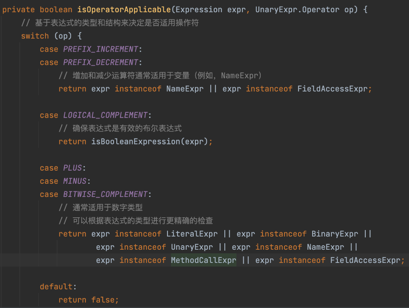

又如ABSMutator中，注释从具体例子出发，极其直观体现了不同的转换情况：

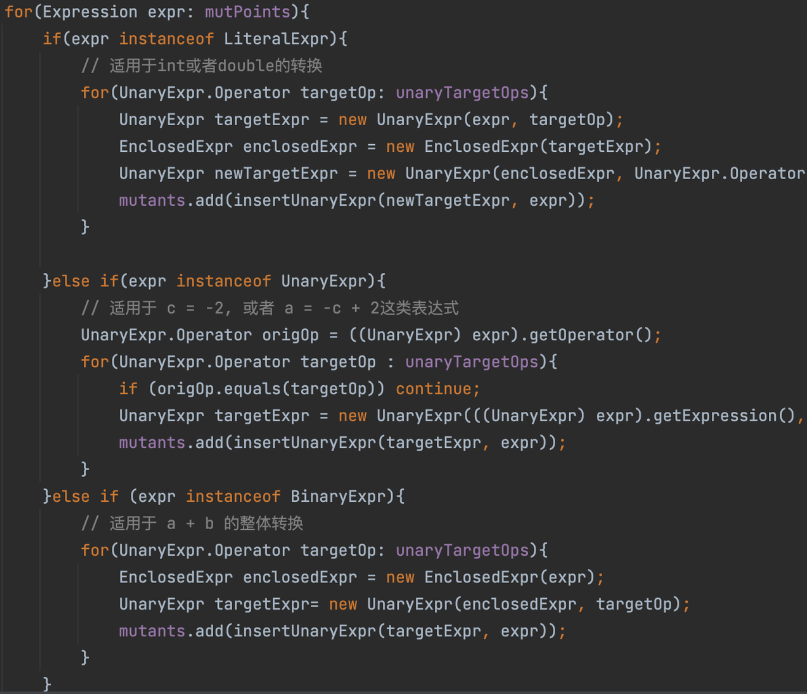

从目录中亦不难看出，项目命名风格保持一致，清晰易懂，对于快速掌握项目结构帮助很大：

```Bash
├── src
│   ├── main
│   │   ├── java
│   │   │   ├── edu
│   │   │   │   └── nju
│   │   │   │       └── mutest
│   │   │   │           ├── MutationEngine.java # 突变选择
│   │   │   │           ├── MutationExecution.java # 突变得分计算
│   │   │   │           ├── example # 测试样例
│   │   │   │           │   ├── ABSExample.java # abs突变算子对应的测试样例
│   │   │   │           │   ├─ # ...
│   │   │   │           ├── mutator # 突变算子的实现
│   │   │   │           │   ├── ABSMutator.java
│   │   │   │           │   ├── AbstractMutator.java
│   │   │   │           │   ├── AIRMutator.java
│   │   │   │           │   ├── AORMutator.java
│   │   │   │           │   ├── BinaryMutator.java
│   │   │   │           │   ├── LCRMutator.java
│   │   │   │           │   ├── Mutator.java
│   │   │   │           │   ├── RORMutator.java
│   │   │   │           │   └── UOIMutator.java
│   │   │   │           └── visitor # 突变点收集、收集条件判断等
└── testsuite # 测试套件
    └── edu
        └── nju
            └── mutest
                └── example
                    ├── ABSTestSuite.class # 突变测试
                    ├── # ...
```
